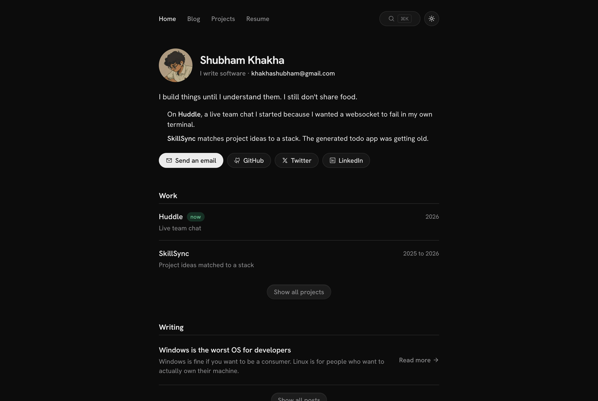

# Sleek Portfolio

A small, fast personal site: a home page, an MDX blog, and a projects page with expanding cards. One 640px column, light and dark themes, and no template copy to delete.

I built it for myself. It is MIT licensed, so fork it and make it yours.



[](https://vercel.com/new/clone?repository-url=https://github.com/shubhook/sleek-portfolio)

## Features

- **MDX blog.** Drop an `.mdx` file in `content/blog/` and it shows up on the home page, `/blog`, search, and the RSS feed. Frontmatter is validated with Zod and reading time is worked out for you.
- **Tech stacks with real icons.** List each project's technologies in one array and they render with [Simple Icons](https://simpleicons.org). Nothing is fetched, so the projects page is fully static.
- **Expanding project cards.** Rest the mouse on a card, click it, or focus it and press Enter, and it grows into a larger panel with a longer write-up, highlights, and the full stack, over a blurred backdrop. A hover-opened panel closes when the mouse leaves it; click inside to keep it open. Escape closes it.
- **Tags and filtering.** Posts carry tags in frontmatter. The blog page filters by tag, and the filter lives in the URL (`/blog?tag=linux`), so tags on a post link straight to the filtered list.
- **GitHub contribution heatmap.** Fetched from GitHub's public contributions page and drawn as an SVG in your site's accent colour. No token, no third-party embed.
- **Command palette.** Cmd+K (Ctrl+K on Windows and Linux) searches posts and projects. It opens as a dialog on desktop and a drawer on phones.
- **Light and dark themes** with no flash on load.
- **Page transitions.** The header stays mounted between pages, and the hero avatar shrinks into the corner logo using view transitions.
- **Smooth scrolling** with Lenis, turned off for anyone who prefers reduced motion.
- **RSS feed** at `/feed.xml`.

## Tech stack

| Layer | Choice |
| --- | --- |
| Runtime and package manager | Bun |
| Framework | Next.js 16 (App Router, Turbopack) |
| UI | React 19, TypeScript |
| Styling | Tailwind CSS 4 plus hand-written tokens in `globals.css` |
| Components | shadcn/ui on Radix, Vaul drawer |
| Content | `next-mdx-remote`, `gray-matter`, Zod |
| Icons | Simple Icons for technologies, Phosphor and Lucide for UI |
| Motion | Motion, Lenis, next-view-transitions |

## Prerequisites

- [Bun](https://bun.sh) 1.2 or newer
- Git

## Environment variables

None are required. The contribution heatmap uses a public GitHub page, so there is no token to set up.

| Variable | Purpose |
| --- | --- |
| `NEXT_PUBLIC_SITE_URL` | Optional. Your site's full URL, used for links in the RSS feed. On Vercel it falls back to the production URL, and locally to `http://localhost:3000`. |

## Getting started

```bash
git clone https://github.com/shubhook/sleek-portfolio.git
cd sleek-portfolio
bun install
bun dev
```

Open [http://localhost:3000](http://localhost:3000).

Other scripts:

```bash
bun run build   # production build
bun start       # serve the build
bun run lint
```

## Make it yours

These are the files you will touch, roughly in order:

| File | What it holds |
| --- | --- |
| `src/lib/site.ts` | Name, email, GitHub handle, social links, resume link |
| `src/app/page.tsx` | The intro paragraph on the home page |
| `src/lib/content.ts` | Projects and the short work list |
| `content/blog/` | Posts, one `.mdx` file each |
| `src/app/globals.css` | Colour tokens for both themes, including `--accent` |
| `public/avatar.jpg` | Your photo |
| `src/assets/projects/` | Project screenshots, imported in `content.ts` |
| `src/app/layout.tsx` | Site metadata and the font |

### Adding a project

Add an entry to `PROJECTS` in `src/lib/content.ts`:

```ts
{
  slug: "huddle",
  name: "Huddle",
  status: "now",                 // the small chip next to the name
  statusKind: "ok",              // "ok" | "accent" | "warn" | "dead" | ""
  dek: "One line for the card.",
  about: "A short paragraph for the expanded card.",
  highlights: [
    "What makes it worth a look.",
    "One point per line.",
  ],
  stack: ["typescript", "bun", "websocket"], // keys from src/lib/tech.ts, in display order
  codeUrl: "https://github.com/shubhook/huddle",
  liveUrl: "https://example.com", // optional
  previewImage: huddlePreview,    // import huddlePreview from "@/assets/projects/huddle.png"
}
```

Cards show the first six technologies and a "+N" chip for the rest; the expanded card shows all of them.

Screenshots look best at 2880×1800 (1440×900 at 2x). Cards crop from the top. Commit the full-size PNG; Next resizes it and serves AVIF or WebP, so visitors download a few kilobytes, not the original.

### Adding a technology

1. Add a key to `TechKey` in `src/lib/tech.ts`, plus its display name in `TECH_NAME`.
2. Import its icon from `simple-icons` in `src/components/tech.tsx` and add it to `ICONS`. Search [simpleicons.org](https://simpleicons.org) for the export name; it's `si` plus the slug, for example `siSvelte`.

Icons render in `currentColor`, so they follow the theme instead of using brand colours.

### Adding a blog post

Create `content/blog/my-post.mdx`. The file name becomes the URL slug.

```mdx
---
title: Windows is the worst OS for developers
date: 2026-01-29
description: One line shown on cards, in search, and in RSS.
tags: [linux, windows, opinion]
---

Write the post in Markdown or MDX.
```

`tags` is optional. Tags are lowercased, and the blog filter is built from whatever tags your posts use.

### The heatmap

`src/lib/github.ts` reads `https://github.com/users/<handle>/contributions` and `src/components/heatmap.tsx` draws it. Change the handle in `SITE.githubHandle`. Colours come from `--heat-0` to `--heat-4` in `globals.css`, mixed from your accent. If GitHub doesn't answer, the section falls back to a link to your profile.

## Deploying

Any Next.js host works. On Vercel, use the button above or import the repo with the default settings. Bun is detected from `bun.lock`.

## License

MIT. See [LICENSE](LICENSE).
